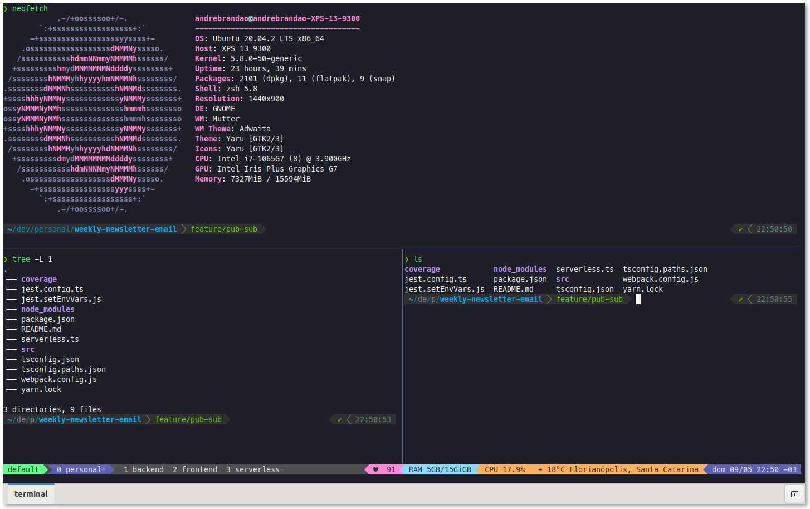

# dotfiles
Zsh, tmux and other config files.

## How to update

Go to the current user and directory commit the files.

```
cd ~

dotfiles status

dotfiles add .tmux.conf

dotfiles commit -m "chore: update tmux conf"

dotfiles push
```

## Tmux Theme

https://draculatheme.com/tmux



## References

- https://news.opensuse.org/2020/03/27/Manage-dotfiles-with-Git/
- https://dotfiles.github.io/
- https://www.atlassian.com/git/tutorials/dotfiles
- https://github.com/webpro/awesome-dotfiles
- http://iamnotmyself.com/2020/11/10/your-terminal-and-you-dotfiles/